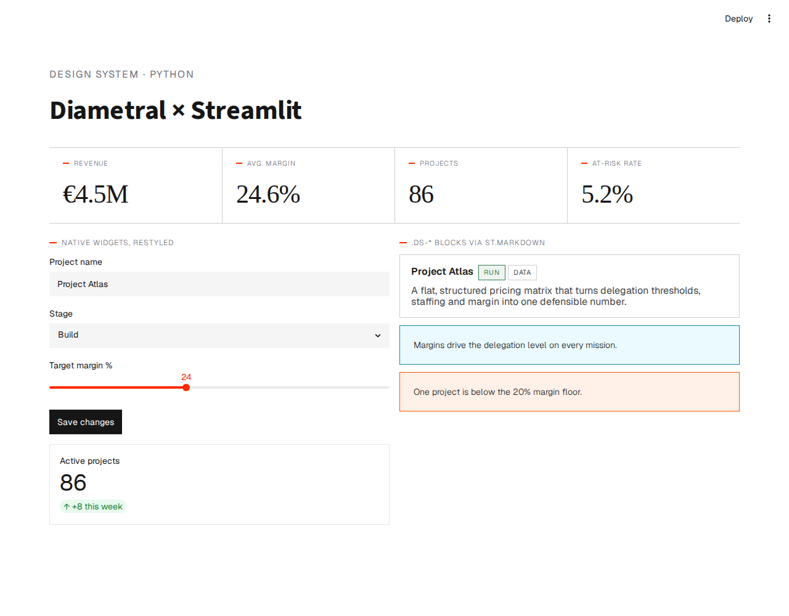

# Diametral × Streamlit example

A minimal Streamlit app styled with the Diametral design system — see
[`docs/streamlit.md`](../../docs/streamlit.md) for the how-and-why.



It does three things:
1. Sets the brand colors for native widgets in [`.streamlit/config.toml`](.streamlit/config.toml).
2. Injects the published `diametral.css` (fetched + inlined, since Streamlit can strip a bare
   `<link>`) plus a few overrides that flatten Streamlit's own widgets.
3. Renders `.ds-*` blocks (stat band, card, callouts, tags) with `st.markdown`.

## Run with Docker

```bash
docker build -t diametral-streamlit .
docker run --rm -p 8501:8501 diametral-streamlit
# open http://localhost:8501
```

## Run locally

```bash
pip install -r requirements.txt
streamlit run app.py
```

> The CSS is fetched from the unpkg CDN at runtime; for offline/air-gapped use, vendor
> `diametral.css` next to `app.py` and read it from disk instead.
