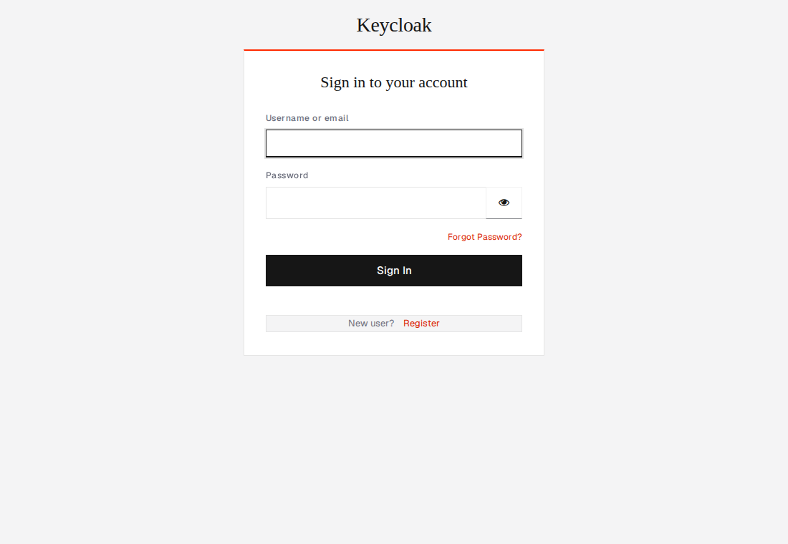

# Diametral Keycloak theme

A complete, drop-in [Keycloak](https://www.keycloak.org/) theme that brands the
**login** flow (sign-in, reset password, OTP, register, update password, verify
email, error/info pages) and the **transactional emails** in the Diametral
language — flat, 1px rules, no radius, Geist + serif, accent action.

It's built to **work directly**: the login theme inherits the classic `keycloak`
theme and restyles it with one stylesheet (so it covers every page and tolerates
Keycloak version differences), and the email theme overrides only the shared HTML
shell (so every email is wrapped automatically).



> Verified on Keycloak 25 (the screenshot above is the live themed login page).

```
diametral/
├── login/
│   ├── theme.properties        # parent=keycloak, styles=css/styles.css
│   └── resources/css/styles.css
└── email/
    ├── theme.properties        # parent=keycloak
    └── html/template.ftl       # the branded email shell
```

## Install

**1. Put the theme where Keycloak looks for themes.** Copy the `diametral/`
folder into your Keycloak's `themes/` directory:

```bash
cp -r diametral "$KEYCLOAK_HOME/themes/"
```

On a container image, bake it in or mount it:

```dockerfile
FROM quay.io/keycloak/keycloak:25.0
COPY diametral /opt/keycloak/themes/diametral
```

or at run time:

```bash
docker run -p 8080:8080 \
  -e KEYCLOAK_ADMIN=admin -e KEYCLOAK_ADMIN_PASSWORD=admin \
  -v "$PWD/diametral:/opt/keycloak/themes/diametral" \
  quay.io/keycloak/keycloak:25.0 start-dev
```

**2. Select it for your realm.** In the admin console → **Realm settings → Themes**:
set **Login theme** = `diametral` and **Email theme** = `diametral`, then Save.
(Or via `kcadm.sh`: `update realms/<realm> -s loginTheme=diametral -s emailTheme=diametral`.)

That's it — the next login page and the next email use the theme.

## Try it locally (Docker)

```bash
docker compose up        # from this folder
# → http://localhost:8080  (admin / admin)
```

The compose file mounts the theme and runs Keycloak in dev mode with theme
caching disabled, so edits to `styles.css` / `template.ftl` show on reload.
Then set the theme on a realm as above and open its login page, e.g.:
`http://localhost:8080/realms/master/account` (or any client's login).

## Customize

- **Colors / type / spacing** live at the top of
  [`login/resources/css/styles.css`](diametral/login/resources/css/styles.css)
  as CSS variables (`--ds-ink`, `--ds-accent`, …) — change them in one place.
- **Logo:** the header renders your realm's *display name*. Set it in
  Realm settings → General, or replace the `#kc-header-wrapper` text with an
  `` via a `login/resources/img/` asset + a CSS background.
- **Emails:** the shell is [`email/html/template.ftl`](diametral/email/html/template.ftl);
  the brand colors are inline (mail clients can't use external CSS). It mirrors the
  JS email kit (`@diametral/design-system/emails`) so app emails and Keycloak
  emails match.

## Notes

- The login theme parents the classic **`keycloak`** theme (not `keycloak.v2`)
  for the most stable, CSS-only restyle. To re-skin `keycloak.v2` instead, set
  `parent=keycloak.v2` and adapt the PatternFly 5 variables.
- For development, disable theme caching:
  `--spi-theme-cache-themes=false --spi-theme-cache-templates=false`
  (the compose file already does this).
